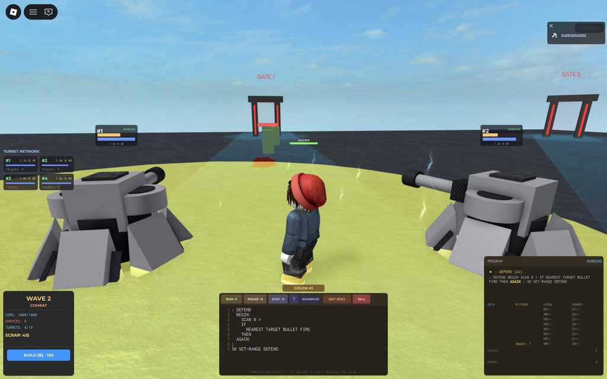
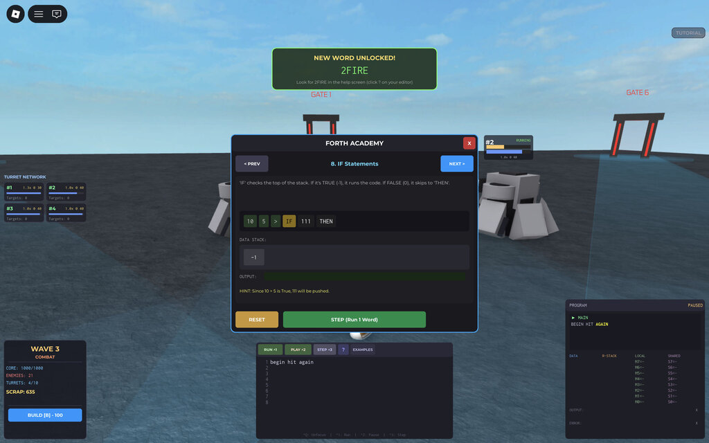
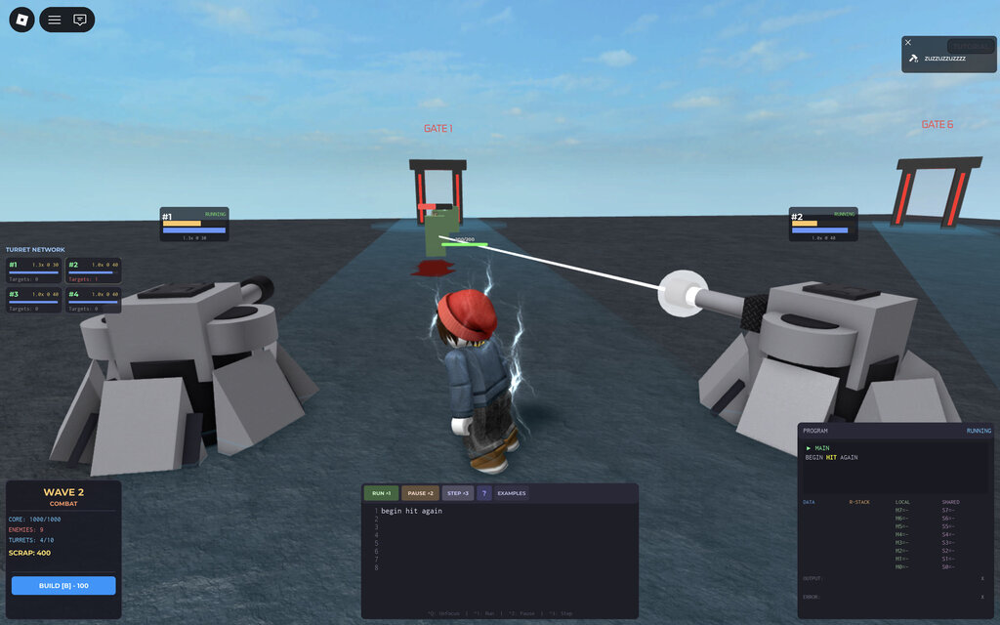
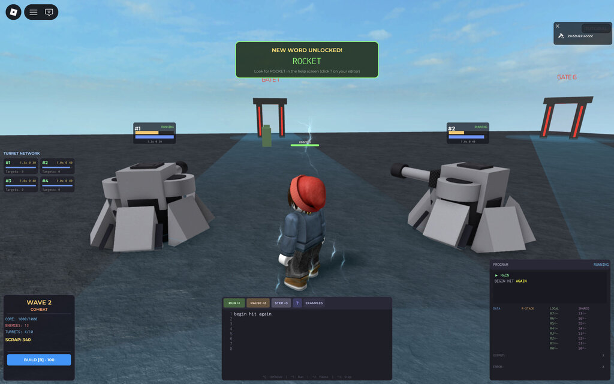
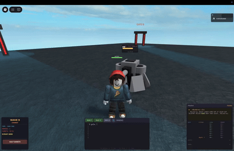

# FORTH TOWER DEFENSE - [Play in Roblox](https://www.roblox.com/games/73272728030902/FORTH-TOWER-DEFENSE)

> 90% ai generated code, cost about 200$ in tokens and about 10 hours of human time









<p align="center">
  
</p>


# DEV ENVIRONMENT

Either download [forth-tower-defense.rbxlx](build/forth-tower-defense.rbxlx) and open it in Roblox Studio, or use build from source.

Fork the repo and install rojo:

```
cargo install rojo
```

Run it with `rojo serve` and if you want a sourcemap to hook it to vscode: `rojo sourcemap --watch default.project.json --output sourcemap.json`

Install the rojo plugin in roblox: https://rojo.space/docs/v7/getting-started/installation/

Click play in roblox studio.

---

This is a programmable Tower Defense game built on the Roblox platform. Unlike traditional tower defense games where turrets act automatically, players must write software in the **Forth** programming language to control their units.

This project combines a custom-built stack-based interpreter written in Luau with a robust game engine handling wave management, enemy pathfinding, and multiplayer replication.

## Table of Contents

1. [Gameplay Overview](#gameplay-overview)
2. [How Forth Works](#how-forth-works)
3. [Code Architecture](#code-architecture)
4. [Interpreter Implementation](#interpreter-implementation)
5. [System Modules](#system-modules)
6. [API Reference](#api-reference)

---

## Gameplay Overview

The objective is to defend a central Core from waves of enemies. There is a strict separation of duties between the Golems (turrets) and the Player:

*   **Golems (Turrets):** These are stationary units. They **cannot** move and **cannot** reload themselves. Their code is strictly for target acquisition and firing.
*   **Players (Commanders):** Players can move, attack manually, and manage resources. Their code is used for **logistics**: monitoring Golem ammo levels, teleporting to low-ammo turrets, and spending Scrap to reload them.

The gameplay loop involves placing Golems, programming their targeting logic, and then programming yourself (the player) to automate the supply chain of ammunition during combat.

---

## How Forth Works

Forth is a stack-based, concatenative programming language. It does not use standard mathematical notation (e.g., `3 + 4`). Instead, it uses **Reverse Polish Notation (RPN)**.

### The Stack
The central concept is the **Data Stack**.
1.  **Pushing:** When you type a number, it goes onto the top of the stack.
2.  **Popping:** When you type an operator (word), it consumes values from the top of the stack and pushes the result back.

**Example: Addition**
To calculate `5 + 3`:
```forth
5 3 +
```
1.  `5` is pushed. Stack: `[5]`
2.  `3` is pushed. Stack: `[5, 3]`
3.  `+` pops `3` and `5`, adds them (`8`), and pushes the result. Stack: `[8]`

### Logic and Control Flow
Conditionals rely on the stack state. `-1` represents True, `0` represents False.

**Example: Basic Turret Logic**
```forth
SCAN 0 > IF
    NEAREST TARGET
    BULLET FIRE
THEN
```
1.  `SCAN` returns the number of enemies (e.g., `2`). Stack: `[2]`
2.  `0` is pushed. Stack: `[2, 0]`
3.  `>` compares them. Is 2 > 0? Yes. Pushes `-1` (True).
4.  `IF` consumes the flag. Since it is True, the code inside executes.
5.  `NEAREST` finds the closest enemy ID.
6.  `TARGET` aims the turret at that ID.
7.  `BULLET` selects the ammo type.
8.  `FIRE` shoots.

### Word Definitions
You can define new commands (Words) using colons.

**Example: Defining a Firing Pattern**
```forth
: BURST
    BULLET FIRE
    BULLET FIRE
;
```
Now typing `BURST` will execute both fire commands.

---

## Code Architecture

The codebase follows a modular Server-Client architecture typical of Roblox development, with a heavy emphasis on separating logic (Server) from visualization (Client).

### Directory Structure

*   **Server (main.server.luau):** Entry point. Manages the game loop, initializes managers, and handles client replication.
*   **Client (main.client.luau):** Handles UI, input (keyboard/mouse), and visual effects rendering.
*   **Shared:** Modules accessible by both contexts, primarily the Interpreter and Config.
*   **Words:** Contains the dictionary definitions for Forth commands (`GolemWords`, `LogisticsWords`, `GameWords`, `SharedWords`).

### Core Systems

1.  **WaveManager:** Controls the flow of the game (Lobby -> Build -> Combat -> Victory/Defeat). It handles the economy (Scrap) and the health of the Core.
2.  **EnemyManager:** Manages enemy entities. It uses a spatial partitioning grid to optimize distance checks (`findNearest`, `findInRange`) since Golems query this data every tick. Movement is physics-based but constrained to the server.
3.  **GolemRegistry:** The central handler for player-owned turrets. It creates the physical models and assigns a unique `Interpreter` instance to each Golem.

---

## Interpreter Implementation

The core of the game is `Interpreter.luau`. It is a custom virtual machine written in Luau.

### Compilation
The `Compiler` module takes a raw string of text and converts it into a list of opcodes and tokens.
1.  **Tokenization:** Splits string by whitespace.
2.  **Structure Parsing:** Identifies control structures (`IF/ELSE/THEN`, `BEGIN/UNTIL`) and validates nesting.
3.  **Bytecode Generation:** Converts text words into numeric Operation Codes (OP) for faster execution (e.g., `OP.PUSH`, `OP.CALL`).

### Execution Cycle
The interpreter does not run blocking code. It uses a **Time-Slicing** approach:
*   **Tick Rate:** The server runs a heartbeat loop.
*   **Step Limit:** Each Golem is allowed a specific number of instructions (ticks) per server frame.
*   **Yielding:** If a program runs an infinite loop (`BEGIN ... AGAIN`), the interpreter pauses execution after the instruction limit is reached and resumes on the next frame. This prevents user code from freezing the game server.

### Persistence
The Interpreter maintains `wordSlots`. When a player defines a word (e.g., `: ATTACK ... ;`), it is compiled and stored in a persistent slot. This allows players to build a library of functions that persist even if the main program loop changes.

---

## System Modules

### 1. Networking (Replication)
To minimize bandwidth, the game uses a hybrid state transfer:
*   **Static State:** Source code and token lists are sent only when a program is compiled or a player starts viewing a Golem.
*   **Dynamic State:** Stack contents, program counter position, and output logs are broadcast frequently but only to players currently viewing that specific Golem's interface.
*   **Visuals:** Firing events (`AttackHit`) are sent as lightweight signals. The Client calculates the exact visual trajectory and particle effects locally.

### 2. EntityRegistry
A unified lookup system for all damageable objects (Players, Monsters, Golems). This allows targeting logic to be polymorphic; a Golem can calculate distance to an Enemy the same way a Player calculates distance to a Golem.

### 3. UI System
*   **EditorPanel:** A text editor with syntax highlighting support (via RichText).
*   **ProgramPanel:** A visual debugger showing the live Data Stack, Memory Slots (M0-M9), and highlighting the currently executing token in real-time.

---

## API Reference

The game exposes specific modules to the Forth interpreter based on the entity type (Golem vs. Player).

### Golem Words (Combat Only)
These words are defined in `GolemWords.luau` and are **only** available to Turrets. Golems cannot move or reload themselves.
*   `SCAN` ( -- n ): Pushes the count of enemies within range.
*   `NEAREST` ( -- id ): Pushes the ID of the closest enemy.
*   `WEAKEST` ( -- id ): Pushes the ID of the enemy with the lowest HP.
*   `TARGET` ( id -- ): Sets the Golem's physical rotation target.
*   `FIRE` ( ammoType -- ): Fires the weapon. Consumes Ammo.
*   `AMMO?` ( -- n ): Pushes current ammo count.
*   `BULLET` / `ROCKET` / `LASER` / `ICE`: Pushes the specific ammo type constant.

### Logistics Words (Player Only)
These words are defined in `LogisticsWords.luau` and are **only** available to Players.
*   `MACHINES` ( -- n ): Count active Golems.
*   `LOWEST-AMMO` ( -- spotId ): Find the ID of the Golem with the lowest ammo percentage.
*   `GOLEM` ( spotId -- ref ): Convert a spot ID into a Golem reference object.
*   `TELEPORT` ( ref -- ): Teleport the player to that Golem.
*   `RELOAD` ( ref -- ): Convert player Scrap into ammo for the referenced Golem. Requires the player to be physically close to the Golem.

### Game Words (Player Movement/Action)
Defined in `GameWords.luau`.
*   `FORWARD` ( n -- ): Move forward n studs.
*   `LEFT` / `RIGHT` ( n -- ): Turn n degrees.
*   `HIT`: Perform a melee attack.

### Memory & Stack (Shared)
*   `M0` - `M9`: Local memory slots private to the specific Interpreter.
*   `S0` - `S9`: Shared memory slots global to the server (allows Golems to communicate with each other).
*   `!` ( val addr -- ): Store value.
*   `@` ( addr -- val ): Fetch value.